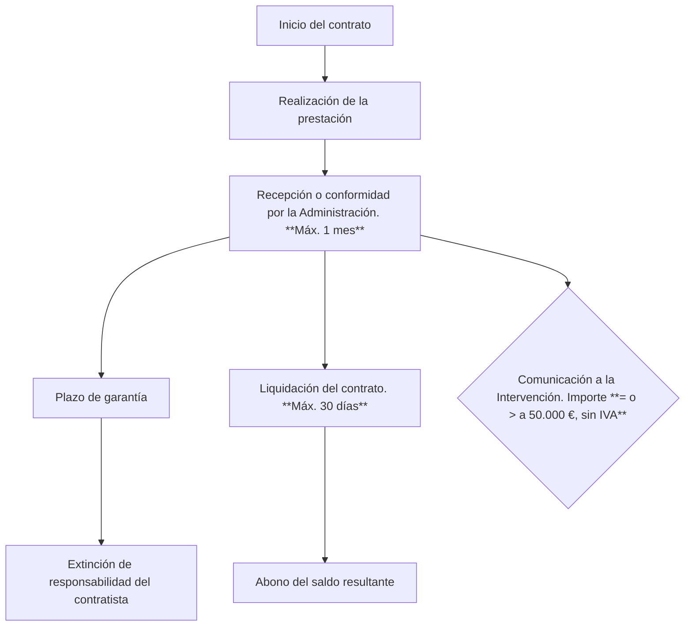

# 📘 Libro II. De los contratos de las Administraciones Públicas: efectos, cumplimiento y extinción de los contratos administrativos

## Índice

- [📘 Libro II. De los contratos de las Administraciones Públicas: efectos, cumplimiento y extinción de los contratos administrativos](#-libro-ii-de-los-contratos-de-las-administraciones-públicas-efectos-cumplimiento-y-extinción-de-los-contratos-administrativos)
  - [Índice](#índice)
  - [🔁 Transmisiones de los derechos de cobro. Artículo 200.](#-transmisiones-de-los-derechos-de-cobro-artículo-200)
  - [✏️ Modificación de los contratos. Artículo 203 a 207 .](#️-modificación-de-los-contratos-artículo-203-a-207-)
    - [📝 Modificaciones previstas en el PCAP. Artículo 204.](#-modificaciones-previstas-en-el-pcap-artículo-204)
    - [⚠️ Modificaciones no previstas en el PCAP: prestaciones adicionales, circunstancias imprevisibles y modificaciones no sustanciales. Artículo 205.](#️-modificaciones-no-previstas-en-el-pcap-prestaciones-adicionales-circunstancias-imprevisibles-y-modificaciones-no-sustanciales-artículo-205)
    - [📌 Obligatoriedad de las modificaciones del contrato. Artículo 206.](#-obligatoriedad-de-las-modificaciones-del-contrato-artículo-206)
    - [📋 Especialidad procedimental. Artículo 207.](#-especialidad-procedimental-artículo-207)
  - [🔁 Cesión de los contratos. Artículo 214.](#-cesión-de-los-contratos-artículo-214)
  - [🧱 Subcontratación. Artículo 215.](#-subcontratación-artículo-215)
      - [✍️ Modificación de lo indicado en la oferta](#️-modificación-de-lo-indicado-en-la-oferta)
      - [❌Penalidades por incumplimiento](#penalidades-por-incumplimiento)
    - [💸Pagos a los subcontratistas](#pagos-a-los-subcontratistas)
  - [⏱️ Supensión de los contratos Artículo 208](#️-supensión-de-los-contratos-artículo-208)
  - [✅ Extinción de los contratos Artículo 209](#-extinción-de-los-contratos-artículo-209)
  - [⏳ Cumplimiento de los contratos y recepción de la prestación Artículo 210](#-cumplimiento-de-los-contratos-y-recepción-de-la-prestación-artículo-210)
  - [🔚 Causas de resolución Artículo 210](#-causas-de-resolución-artículo-210)
  

## 🔁 Transmisiones de los derechos de cobro. [Artículo 200](https://www.boe.es/buscar/act.php?id=BOE-A-2017-12902#a2-12).
Los contratistas que tengan derecho de cobro frente a la Administración, podrán ceder el mismo conforme a derecho.

Para que la cesión del derecho de cobro sea efectiva frente a la Administración será requisito __imprescindible la notificación__ fehaciente a la misma del __acuerdo de cesión__.

## ✏️ Modificación de los contratos. [Artículo 203 a 207](https://www.boe.es/buscar/act.php?id=BOE-A-2017-12902#a2-15) .

Los contratos solo podrán ser modificados por razones de __interés público__ en los casos y en las formas previstas en esta norma y __de acuerdo__ con el procedimiento establecido en el __artículo 191, con las peculiaridades del artículo 207__.

Cuando los contratos administrativos __no puedan modificarse por las causas previstas en la norma__, tendrá que __procederse a su resolución__ y a la celebración de otro bajo las condiciones pertinentes. En su caso, podrán adoptarse medidas que resulten necesarias por razones de seguridad, servicio público o posible ruina.

Las __modificaciones del contrato deberán formalizarse y publicarse__ en el perfil del contratante y si además es SARA, salvo contratos especiales, en el DOUE.

### 📝 Modificaciones previstas en el PCAP. [Artículo 204](https://www.boe.es/buscar/act.php?id=BOE-A-2017-12902#a2-16).

Los contratos de las Administraciones Públicas podrán modificarse durante su vigencia **hasta un máximo del 20 % del precio inicial** cuando se hubiera establecido esta posibilidad en los PCAP.

La cláusula de modificación deberá estar formulada de forma **clara, precia e inequívoca**, asimismo, en lo que respecta a su contenido deberá precisarse con detalle suficiente:

- Su alcance, límites y naturaleza.

- Las condiciones en que podrá hacerse uso de la misma por referencia a circunstancias cuya concurrencia pueda verificarse de forma objetiva.

- El procedimiento que haya de seguirse para realizar la modificación.

En **ningún caso podrá suponer el establecimiento de nuevos precios unitarios**.

La formulación y contenido de la cláusula de modificación deberá ser tal que en todo modo permita a los candidatos o licitadores comprender su alcance exacto e interpretarla de la misma forma.

En **ningún caso** los órganos de contratación podrán prever en el PCAP modificaciones que puedan **alterar la naturaleza global** del contrato inicial. Este sería el caso de un cambio de tipo de contrato, pero no lo será cuando se sustituya alguna unidad de obra, suministro o servicio puntual.

### ⚠️ Modificaciones no previstas en el PCAP: prestaciones adicionales, circunstancias imprevisibles y modificaciones no sustanciales. [Artículo 205](https://www.boe.es/buscar/act.php?id=BOE-A-2017-12902#a2-17).

Las modificaciones no previstas en el pliego de cláusulas administrativas particulares o que, habiendo sido previstas, no se ajusten a lo establecido en el artículo anterior, solo podrán conllevar las **variaciones estrictamente indispensables** para responder a la causa objetiva que la haga necesaria y basarse en los siguientes supuestos:

- __ Cuando deviniera necesario añadir obras, suministros o servicios adicionales a los inicialmente contratados, siempre y cuando se cumplan los dos requisitos siguientes __:

    - Que el __cambio de contratista no fuera posible__ por razones de tipo económico o técnico.

   - Que la modificación del contrato implique una alteración en su cuantía que no exceda, **aislada o conjuntamente** con otras modificaciones acordadas conforme a este artículo, del **50 % de su precio inicial, IVA excluido**.

- __ Cuando la necesidad de modificar un contrato vigente se derive de circunstancias sobrevenidas y que fueran imprevisibles en el momento en que tuvo lugar la licitación del contrato, siempre y cuando se cumplan los siguientes tres requisitos __:

    - Que la necesidad de la modificación se derive de una circunstancia que una Administración diligente no hubiese podido prever.

    - Que la modificación no altere la naturaleza global del contrato.

    - Que la modificación del contrato implique una alteración en su cuantía que no exceda, **aislada o conjuntamente** con otras modificaciones acordadas conforme a este artículo, del **50 % de su precio inicial, IVA excluido**.

- __Cuando las modificaciones no sean sustanciales.__: 
  
  - Se consideran modificaciones sustanciales cuando estas tengan como resultado un contrato de naturaleza materialmente diferente al celebrado en un principio y, en cualquier caso, cuando se cumplan una o varias de las siguientes condiciones:
    - Que la modificación introduzca condiciones que, de haber figurado en el procedimiento inicial, habrían permitido la selección de  candidatos distintos de los seleccionados inicialmente o la aceptación de una oferta distinta.
    - Que la modificación altere el equilibrio económico del contrato en beneficio del contratista de una manera que no estaba prevista en el contrato inicial.
    - Que la modificación amplíe de forma importante el ámbito del contrato.

### 📌 Obligatoriedad de las modificaciones del contrato. [Artículo 206](https://www.boe.es/buscar/act.php?id=BOE-A-2017-12902#a2-18).

En los supuestos de modificaciones __no previstas en el PCAP__, estas serán obligatorias para el contratista cuando implique, aislada o conjuntamente, una alteración en su cuantía que __no excede del 20 % del precio inicial del contrato, IVA excluido__.

Cuando la modificación __no resulte obligatoria para el contratista__, la misma solo podrá ser acordada por el órgano de contratación __previa conformidad por escrito__ del mismo, resolviéndose el contrato en caso contrario.

### 📋 Especialidad procedimental. [Artículo 207](https://www.boe.es/buscar/act.php?id=BOE-A-2017-12902#a2-19).

En las modificaciones previstas en el PCAP se actuará conforme a lo establecido en los pliegos.

En las **modificaciones no previstas** deberá darse **audiencia al redactor del proyecto** o redactor de la documentación técnica, si estos hubiesen sido preparados por un tercero ajeno al órgano de contratación, para que, en el plazo **no inferior a 3 días**, formule las consideraciones que crea oportunas.

Tendrá que **publicarse el anuncio de modificación en el DOUE cuando el contrato sea SARA** (salvo en las excepciones del artículo 207.2) e, independientemente de su cuantía, en el **perfil del contratante**, en el plazo de **5 días desde la aprobación de la misma**. Acompañado de las alegaciones del contratista y de todos los informes que, en su caso, se hubieran recabado con carácter previo a su aprobación.

## 🔁 Cesión de los contratos. [Artículo 214](https://www.boe.es/buscar/act.php?id=BOE-A-2017-12902#a2-26).
Para que los contratistas puedan ceder sus derechos y obligaciones a terceros, los pliegos deberán contemplar, como mínimo, la exigencia de los siguientes requisitos:

Que el **órgano de contratación autorice, de forma previa y expresa, la cesión**. El **plazo** para la notificación de la resolución sobre la solicitud de autorización **será de 2 meses**, transcurrido el cual deberá entenderse **otorgada por silencio administrativo**.

Que el cedente tenga **ejecutado al menos un 20 % del importe del contrato** o, cuando se trate de un **contrato de concesión** de obras o de servicios haya efectuado su explotación durante al menos **1/5 del plazo de duración del contrato**.

El **cesionario tiene que tener capacidad para contratar** con la Administración **y la solvencia** que resulte exigible en función de la fase de ejecución del contrato.

La **cesión se formalizará** entre el adjudicatario y el cesionario **mediante escritura pública**.

El **cesionario quedará subrogado** en todos los derechos y obligaciones que corresponderían al cedente.

## 🧱 Subcontratación. [Artículo 215](https://www.boe.es/buscar/act.php?id=BOE-A-2017-12902#a2-27).

**OPCIONAL** 

- __Si se prevé en los pliegos__, los licitadores deberán indicar en la oferta la **parte** del contrato que tengan previsto subcontratar, señalando su **importe**, y el nombre o perfil empresarial, definido por referencia a las condiciones de solvencia profesional o técnica, de los subcontratistas a los que se vaya a encomendar su realización.

**OBLIGATORIO** 
- En todo caso, el **contratista deberá comunicar por escrito**, tras la adjudicación del contrato y, a más tardar, cuando inicie la ejecución de este, al órgano de contratación **la intención de celebrar los subcontratos**, señalando la **parte** que se pretende subcontratar y la **identidad del subcontratista**, **justificando su aptitud** (salvo que esté clasificado) y **acreditando que no estén incursos en prohibición de contratar**. La **acreditación de aptitud** podrá realizarse inmediatamente **después de la realización del subcontrato** si esta es necesaria para atender a su **situación de emergencia** **o** que exija la adopción de **medidas urgentes** y así se justifique adecuadamente.

#### ✍️ Modificación de lo indicado en la oferta
Si los pliegos hubiesen impuesto a los licitadores la obligación de comunicar la subcontratación, los subcontratos que no se ajusten a lo indicado en la oferta del licitador, por celebrarse con empresarios distintos a los indicados o por referirse a otras partes de la prestación, **no podrán celebrarse hasta que transcurran 20 días desde que se hubiese cursado la notificación y aportado la documentación que se exigía** para la subcontratación no previstas en los pliegos (punto anterior), **salvo** que la **Administración lo autorice antes** **o** se trate de una **emergencia o se exijan medidas urgentes** y el contratista lo justifique adecuadamente. En principio **solo se requiere autorización expresa para los contratos de carácter reservado o secreto**.

#### ❌Penalidades por incumplimiento

El incumplimiento en materia de subcontratación por parte del contratista tendrá, entre otras previstas, alguna de las siguientes consecuencias, cuando así se hubiera previsto en los pliegos:

La imposición al contratista de una **penalidad de hasta un 50 % del importe del subcontrato**.

La **resolución del contrato**, siempre y cuando se haya establecido como un **incumplimiento de las obligaciones esenciales**.

### 💸Pagos a los subcontratistas

El contratista está obligado a abonar a los subcontratistas el precio pactado en los plazos y condiciones recogidas en este artículo.

Los plazos fijados no podrán ser más desfavorables que los previstos en la Ley 3/2004, siempre que el subcontratista haya entregado la factura en los plazos establecidos legalmente.

Deberán utilizar en su relación con el contratista principal la **factura electrónica, cuando el importe de la misma supere los 5.000 €**.

Los subcontratistas no podrán renunciar válidamente a los derechos que tengan reconocidos.

El **PCAP** podrá prever que se realicen **pagos directos a los subcontratistas**. Estos pagos se entenderán realizados **por cuenta del contratista principal**.

Sin perjuicio de la DA 51, los **subcontratistas no tendrán acción directa frente a la Administración contratante** por las obligaciones contraídas con ellos por el contratista como consecuencia de la ejecución del contrato principal y los subcontratos.

## ⏱️ Supensión de los contratos [Artículo 208](https://www.boe.es/buscar/act.php?id=BOE-A-2017-12902&p=20250402&tn=1#a2-20)

Si la **Administración acordase la suspensión del contrato** o aquella tuviere lugar por una **demora** en el **pago** por tiempo superior **a 4 meses** a tenor de lo previsto en el artículo 198.5 de la LCSP, **se extenderá un acta**, de oficio o a solicitud del contratista, en la que se consignarán las **circunstancias que la han motivado** y la situación de hecho en la ejecución de aquel.

Salvo que el PCAP establezca otra cosa, **solo se indemnizarán los gastos correspondientes a** las **pólizas de seguro suscritas por el contratista que estuviesen recogidas en el PCAP** y, cuando se acredite fehacientemente su realidad, efectividad e importe, algunos conceptos como **gastos por mantenimiento de la garantía definitiva** o alquileres o **costes de mantenimiento de maquinaria e instalaciones que no se pudiesen emplear para otros fines distintos** a los del contrato (ver el artículo 208.2).

**Solo se indemnizarán los períodos** de suspensión que estuvieran **documentados en** la correspondiente **acta**.

El **derecho a reclamar prescribe en 1 año** contado desde que el contratista reciba la orden de reanudar la ejecución del contrato.

## ✅ Extinción de los contratos [Artículo 209](https://www.boe.es/buscar/act.php?id=BOE-A-2017-12902&p=20250402&tn=1#a2-21)

Los contratos se extinguirán por su **cumplimiento** o por **resolución** 

## ⏳ Cumplimiento de los contratos y recepción de la prestación [Artículo 210](https://www.boe.es/buscar/act.php?id=BOE-A-2017-12902&p=20250402&tn=1#a2-22)

El contrato se entenderá cumplido por el contratista cuando este haya realizado, de acuerdo con los términos del mismo y a satisfacción de la Administración, la **totalidad de la prestación**.

La constatación del cumplimiento exigirá por parte de la Administración un **acto formal y positivo de recepción o de conformidad** dentro del **mes siguiente** a la **entrega o realización del objeto del contrato**, o en el plazo que determine el PCAP por razón de sus características. A la Intervención de la Administración correspondiente le será comunicado, cuando sea preceptivo, la fecha y lugar del acto, para su eventual asistencia en ejercicio de sus funciones de comprobación de la inversión.

En los contratos se fijará un **plazo de garantía a contar desde la fecha de recepción o conformidad**, transcurrido el cual sin objeciones por parte de la Administración, salvo los supuestos en que se establezca otro plazo en esta Ley o en otras normas, quedará extinguida la responsabilidad del contratista. Se exceptúan del plazo de garantía aquellos contratos en los que por su naturaleza o características no resulte necesario, lo que deberá justificarse debidamente en el expediente de contratación, consignándolo expresamente en el pliego.

Dentro del plazo de **30 días a contar desde la fecha del acta de recepción o conformidad** deberá **acordarse** en su caso y cuando la naturaleza del contrato lo exija, y ser notificada al contratista **la liquidación correspondiente del contrato**, y abonársele, en su caso, el saldo resultante.  

## 🔚 Causas de resolución [Artículo 210](https://www.boe.es/buscar/act.php?id=BOE-A-2017-12902&p=20250402&tn=1#a2-23)

La resolución de un contrato tiene lugar cuando se extingue el contrato por una causa distinta a la de su cumplimiento.

El artículo 212.8 de la LCSP dispone que los expedientes de resolución contractual deberán ser **instruidos y resueltos en el plazo máximo de 8 meses**.

Se trata de una potestad exclusividad del órgano de contratación, que puede iniciarse de oficio o a instancia del contratista.

Algunas causas generales de resolución son las siguientes:
- **Muerte o incapacidad sobrevenida del contratista** o la extinción de la personalidad jurídica de la sociedad contratista, sin perjuicio de la sucesión del contratista (art. 98). En caso de muerte o incapacidad, la Administración podrá acordar la continuidad del contrato con sus herederos o sucesores.
- La **declaración de concurso o la declaración de insolvencia** en cualquier otro procedimiento.
- El **mutuo acuerdo entre las partes**. En este caso, los derechos de las partes se acomodarán a lo estipulado por ellos mismas. Esta causa de resolución no procederá cuando concurra otra que sea imputable al contratista.
- **Demora en el cumplimiento de los plazos** por parte del contratista. Este retraso se tendrá en cuenta con respecto al plan de trabajo establecido en el contrato o en el PCAP, y tendrá lugar cuando sea superior a 1/3 del plazo de duración inicial del contrato, posibles prórrogas incluidas. 
- **Incumplimiento de la obligación principal o de las restantes obligaciones esenciales del contrato**, siempre que estas hubiesen declarado como tal en el PCAP y concurran los dos siguientes requisitos: que se respete la libertad de pactos y que figuren de manera precisa, clara e inequívoca en el PCAP.
- Si existe una **imposibilidad de ejecutar la prestación en los términos inicialmente pactados, y no sea posible modificar el contrato**, el contratista tendrá derecho a una indemnización del 3 % del importe de la prestación dejada de realizar, salvo que la causa sea imputable al contratista o este rechace la modificación contractual propuesta por la Administración al amparo del artículo 205.

En cuanto a los efectos: 

- El **incumplimiento por parte de la Administración** de las obligaciones del contrato determinará para aquella, con carácter general, el **pago de los daños y perjuicios** que por tal causa se irroguen al contratista.
-	El **incumplimiento culpable del contratista** conllevará que le sea **incautada la garantía** y deberá, además, **indemnizar a la Administración los daños y perjuicios** ocasionados en lo que excedan del importe de la garantía incautada.
